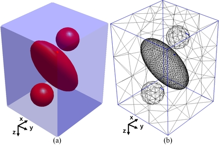
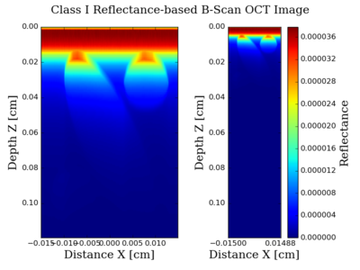
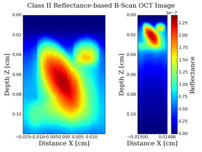

 

  

# Massively Parallel Simulator of Optical Coherence Tomography of Inhomogeneous Turbid Media
OCT-MPS is a massively parallel simulator of optical coherence tomography (OCT) of inhomogeneous turbid media that obtains both Class I diffusive reflectance, due to ballistic and quasi-ballistic scattered photons, and Class II diffusive reflectance due to multiple scattered photons. This Monte Carlo-based simulator is implemented on graphic processing units (GPUs) to exploit the parallel nature of propagation of photons in tissue. It models an arbitrary shaped object as a tetrahedron-based mesh and uses an advanced importance sampling scheme. This new simulator speeds up simulations of OCT of inhomogeneous turbid media by at least one order of magnitude, therefore it is considerably more practical to use than its central processing unit (CPU)-based counterpart. 

## Usage
To use the OCT-MPS you should pass the opt input file (.opt), containing optical properties of regions, the mesh file (.mesh) 
and the bias file (.mci) as the input to the program as follows:
```
OCT-MPS [-S<seed>] [-G<num GPUs>] <input opt file> <input mesh file> <input bias file>                                   
                                                                                                                                    
  -S: seed for random number generation (MT only)                                                   
  -G: set the number of GPUs this program uses
```

### Example
```
./OCT-MPS input/Ellipsoidand2Spheres/ellipsoid_and_two_spheres_60_degree.opt input/E
llipsoidand2Spheres/ellipsoid_and_two_spheres_60_degree.mesh input/Ellipsoidand2Spheres/BiasStartup.mci
```

## Generating Mesh File
To generate OCT-MPS input mesh file, you can use [Netgen](http://auroraold.asc.tuwien.ac.at/~schoeberl/wiki/index.php/Netgen). 
First you need to install Netgen (please make sure that the Netgen python-api is installed). Once Netgen is installed you can create mesh file
using the python script in utils/python-utils/mesh_generator.py. 

###Example:
```
python3 mesh_generator.py --geo_file=../../input/WangBump/WangBump.geo --output_mesh_file=test.mesh
```

## Authors
Siavash Malektaji, 
Mauricio R. Escobar I., 
Ivan T. Lima Jr., 
Sherif S. Sherif (Sherif.Sherif@umanitoba.ca)

## License
See [LICENSE](LICENSE).

## References

If you use this software in a scientific publication, please cite the following paper:

Siavash Malektaji, Mauricio R. Escobar I., Ivan T. Lima Jr., and Sherif S. Sherif, "Massively Parallel Simulator of Optical Coherence  Tomography of Inhomogeneous Turbid Media".
